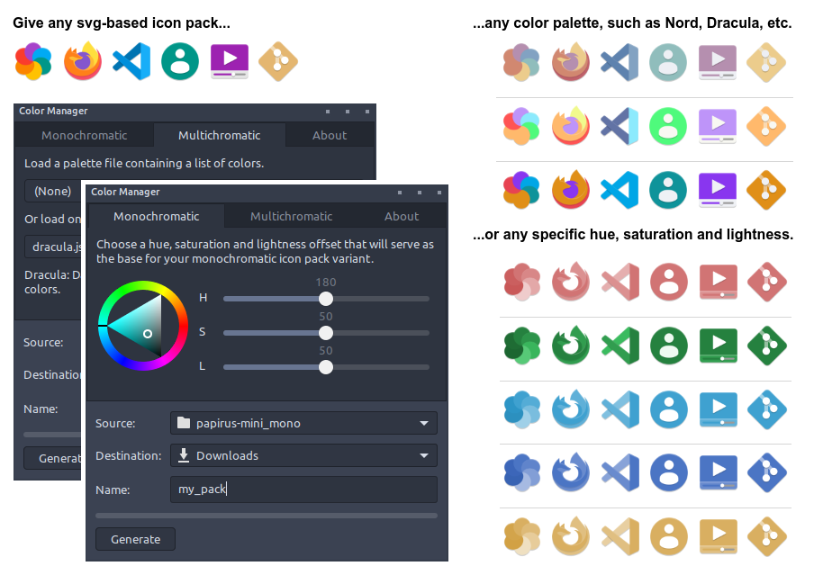
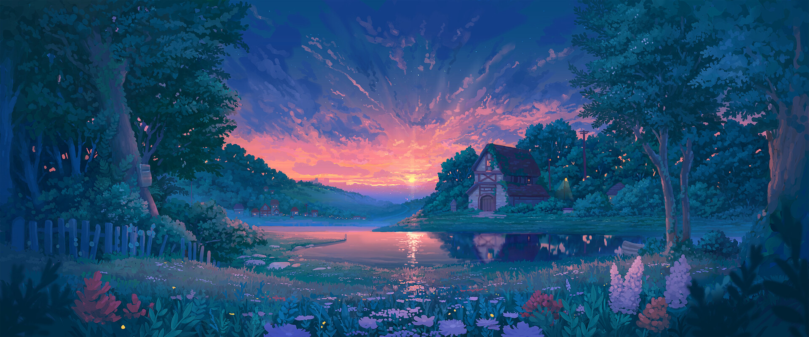
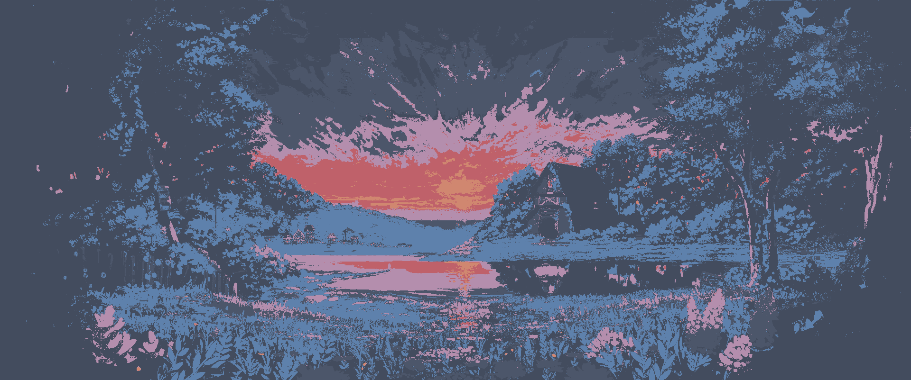

# Color Manager 

[Roadmap](#roadmap) | [Features](#features) | [Use](#use) | [Requests](#requests) | [Contribute](#contribute)

Color Manager is a program for recoloring and manipulating existing icon packs, wallpapers and themes. The program is designed for [NovaOS](https://github.com/NicklasVraa/NovaOS) and is currently in **early development**. The first release will be late August 2023. In the meantime, this repository will act as a preview.



**Add customizable backdrops to all your icons.**
| Examples | `rounding=0.0` | `rounding=0.5` | `rounding=1.0` |
| :------: | :------------: | :------------: | :------------: |
| `padding=0`<br> `color="#000000"` |  |  |  |
| `padding=2`<br> `color="#112288"` |  |  |  |
| `padding=4`<br> `color="#551144"` |  |  |  |


**Instantly recolor artwork such as wallpapers.**
| Operation | Result |
| :---------: | ------ |
| **Original** |  |
| **Monochrome**:<br>`(0.6,0.54,0.5)` |  |
| **Multichrome**:<br>`nord.json`<br>`smooth=false` |  |
| **Multichrome**:<br>`nord.json`<br>`smooth=true` |  |
| **Extraction**:<br>Original `num=10` |  |

**GUI Demo**:


**Note**: If you publish anything that was generated using this program, make sure to credit the original creator and this repository.


## Roadmap <a name="roadmap"></a>
- [x] Basic framework for manipulating icon packs.
- [x] Grayscale, monochromatic and multichromatic recoloring functions.
- [x] Command-line interface.
- [x] Graphical user interface based on the GTK framework.
- [x] Python pip package.
- [x] Full support for pngs and jpgs.
- [x] Generate palette from source image or svg.
- [x] Remove metadata from svgs.
- [x] Adding basic geometry to the backgrounds of svg icons.
- [ ] Optional automatic palette extending.
- [ ] Basic framework for manipulating GTK, Cinnamon and Metacity themes.
- [ ] Intelligent color inversion.
- [ ] GNU/Linux binary (deb, flatpak, appimage).


## Features <a name="features"></a>
Currently, three operations are supported:
| Type | Result | Speed | Supports |
| ---- | ------ | ----- | -------- |
| Monochrome recoloring  | A monochromatic variant, colored by appropriate shades of the provided base color. | ~5000 svgs/sec | svg, png, jpg |
| Multichrome recoloring | A multichromatic variant, where all colors are replaced by their nearest perceived equivalent that adheres to the provided color palette. | ~100 svgs/sec | svg, png, jpg |
| Extract colors | Returns and optionally saves the color palette of an image, in specified detail. | ~100 colors/sec | svg, png, jpg |
| Add backdrop | Add a rectangular or elliptical background (and anything in between) to all svg icons. | ~5000 svgs/sec | svg |

Speeds were recorded with an Intel i7-4770K CPU. Any asset can serve as the base for any color palette or base color. Svg recolorings will always be perfect, but png/jpgs may require experimentation.

**Tip**: To increase the quality, i.e. decrease the perceived noise of multichromatic recolorings of pngs/jpgs, either...
- Increase the number of colors in the palette you provide to the program, e.g. populate it with slight variations of the existing colors
- Decrease the number of colors in your original image, e.g. using a function like `Image.quantize()` from `pillow`.
- Experiment with setting `smooth` to `true`/`false` in the palette json file.


## Using the Program<a name="use"></a>
Either import `utils` into your own script and call its functions, e.g.:
```python
from color_manager import utils
```
Recoloring collections:
```python
src     = "test_pack"
name    = "my_pack"
dest    = "~/Downloads"
hsl     = (0.5, 0.5, 0.5) # = rc.norm_hsl(180, 50, 50)
palette = "palettes/dracula.json"

utils.recolor(src, dest, name, hsl) # Either hsl or palette.
```
Extracting color palette:
```python
image      = "test_pack/imgs/lake_cabin.png" # Also try an svg.
num_colors = 10
output     = "resources/palette.png" # Optional - saves colors as image.

utils.extract_colors(image, num_colors, output)
```
Adding backdrops to svg icons:
```python
src      = "test_pack"
name     = "my_pack"
dest     = "~/Downloads"
color    = "#000000" # Optional - Defaults to black.
padding  = 0   # Optional - Between backdrop and edge.
rounding = 0.5 # Optional - Between 0 and 1, i.e. rectangle and ellipse.

utils.add_backdrop(src, dest, name, color, padding, rounding)
```

Or launch the GUI by running `python3 color_manager/gui.py` in a terminal from the project's root directory. The GUI will adopt your active theme. Dependencies: `colormath`, `tqdm` and `pillow`. For the GUI, `pygobject` (GTK bindings) must also be installed.


## Requests <a name="requests"></a>
Until the release official release of Color Manager, I will be taking requests for recolorings. Simply submit a feature request, specifying what you would like to see. Please star the repository or consider donating, and I will upload your requested variant. Also consider showing the creators of the original artworks some love.


## Contribute <a name="contribute"></a>
If you are experienced with packaging projects such as this for easy distribution, i.e. as deb, appimage or flatpaks, please contact me.

---
**Legal Notice**: This repository, including any and all of its forks and derivatives, may NOT be used in the development or training of any machine learning model of any kind, without the explicit permission of the owner of the original repository.
