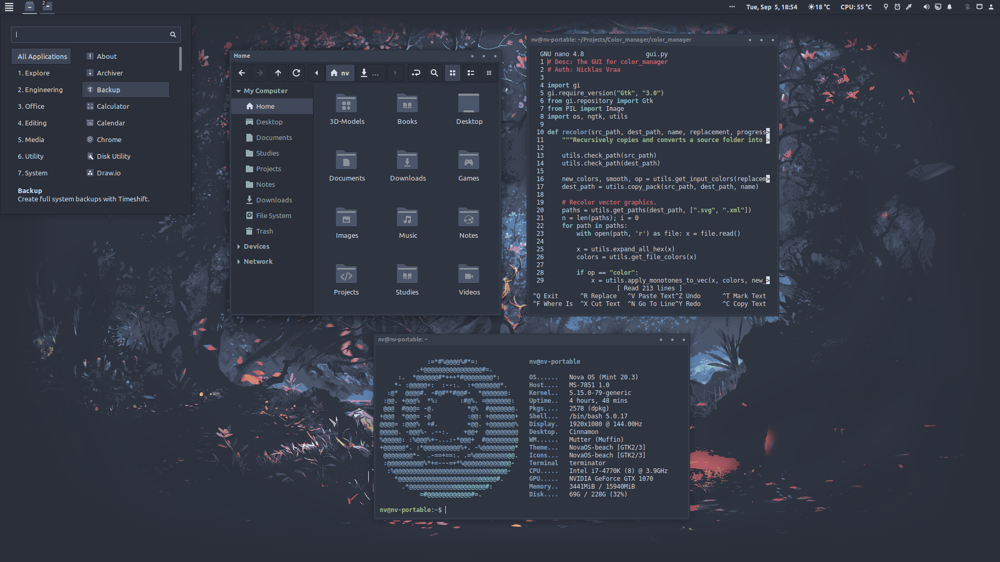
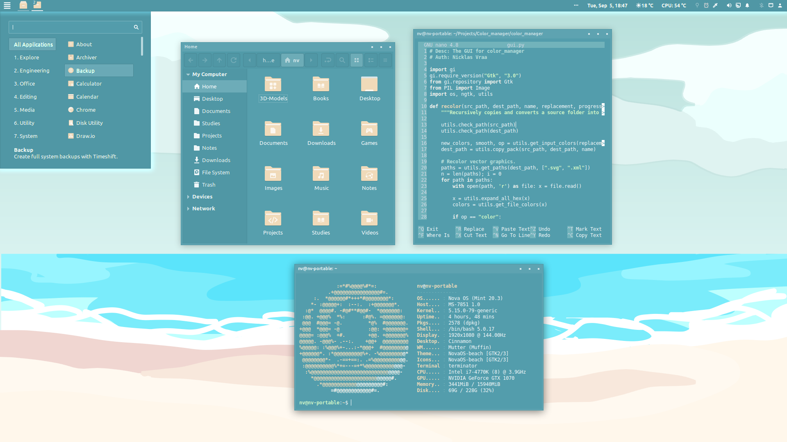
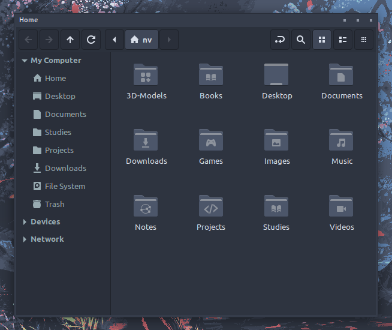
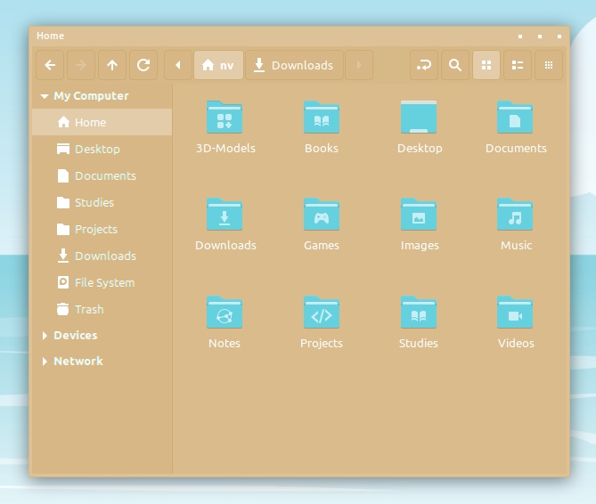
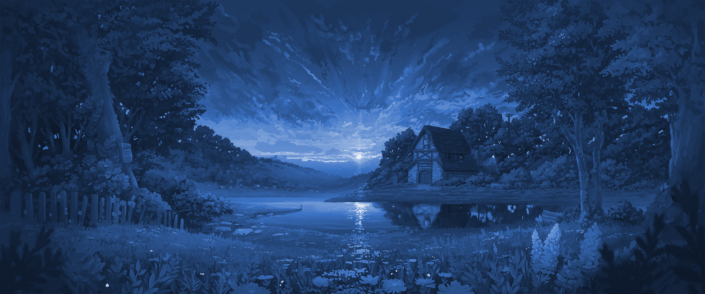
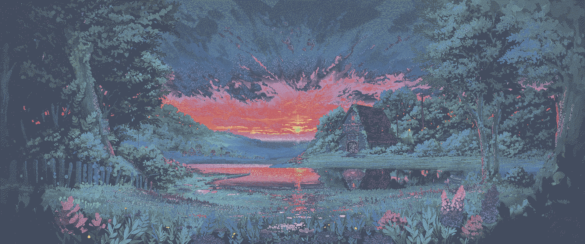
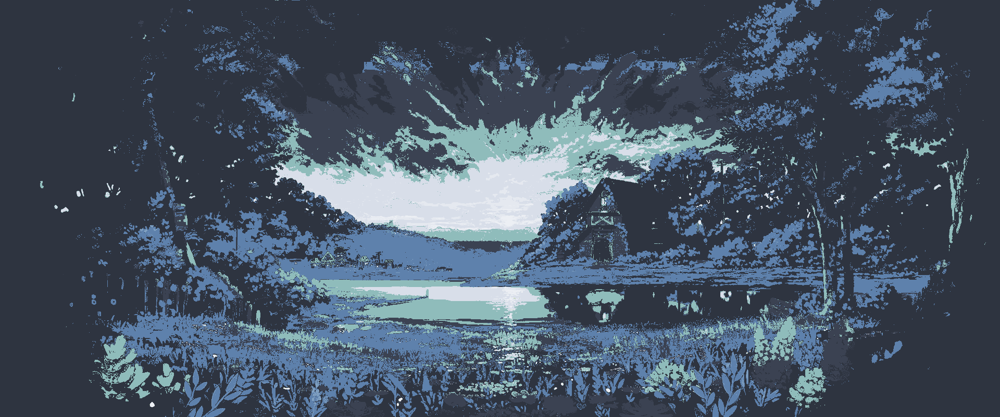

# Color Manager 

[Showcase](#showcase) | [Examples](#examples) | [Performance](#performance) | [Roadmap](#roadmap) | [Requests](#requests) | [Contribute](#contribute)

Color Manager is a program for recoloring and manipulating existing icon packs, themes and wallpapers. The program is designed for [NovaOS](https://github.com/NicklasVraa/NovaOS) (Linux) and is written in python. If you publish anything that was generated using this program, make sure to credit the original creator and this repository.


## Showcase <a name="showcase"></a>
Below are examples of what can be done using this library. Using it in a simple python script, you can define a pipeline to automatically customize assets exactly as you see fit.

### Icon-pack Recoloring and Editing


**Add customizable backdrops to all your icons.**
| Examples | `rounding=0.0` | `rounding=0.5` | `rounding=1.0` |
| :------: | :------------: | :------------: | :------------: |
| `padding=0`<br> `color="#000000"` |  |  |  |
| `padding=2`<br> `color="#112288"` |  |  |  |
| `padding=4`<br> `color="#551144"` |  |  |  |

### Theme-pack Recoloring
In these examples, my own [theme](https://github.com/NicklasVraa/NovaOS-nord-Theme) and [icon-pack](https://github.com/NicklasVraa/NovaOS-nord-Icons) have been recolored for inspiration. These are available for download under releases.

|   |   |   |
|:-:|:-:|:-:|
|  Nord |  Woodland |  Beach |

<details><summary>More theme recoloring examples</summary>

|     |     |
| --- | --- |
|  |  |
|  |  |

These are simple monochromatic recolors of [my own theme](https://github.com/NicklasVraa/NovaOS-nord-Theme) and the papirus icon pack. Multichromatic recoloring based on a palette or mapping also works. Recoloring works on any svg/css/png/jpg/xml-based theme, which include GTK-, Cinnamon-, Gnome-shell- and metacity-themes.
</details>

### Wallpaper Recoloring
| Operation | Result |
| :---------: | ------ |
| **Original** |  |
| **Monochrome**:<br>`(0.6,0.54,0.5)` |  |
| **Multichrome**:<br>`nord.json`<br>`smooth=false` |  |
| **Multichrome**:<br>`nord.json`<br>`smooth=true` |  |
| **Remapping**:<br>`renord.json`<br><small>Remap of previous<br>to alterate nord<br>colors</small>. |  |
| **Extraction**:<br>Original `num=10` |  |

### GUI
The program is also available with a graphical frontend. Features for this may lack slightly behind.


## Examples<a name="examples"></a>
Either import `utils` into your own script and call its functions, e.g.:
```python
from color_manager import utils
```
Recoloring collections:
```python
src     = "test/graphics" # Also try "test/theme"
name    = "my_pack"
dest    = "~/Downloads"
color   = (0.5, 0.5, 0.5) # = rc.norm_hsl(180, 50, 50)
palette = "palettes/nord.json"
mapping = "mappings/renord.json"

utils.recolor(src, dest, name, color) # Either color, palette, or mapping.
```
Extracting color palette:
```python
image      = "test/graphics/imgs/lake_cabin.png" # Also try an svg.
num_colors = 10 # May be any number.
output     = "resources/palette.png" # Optional - saves colors as image.

utils.extract_colors(image, num_colors, output)
```
Adding backdrops to svg icons:
```python
src      = "test/graphics"
name     = "my_pack"
dest     = "~/Downloads"
color    = "#000000" # Optional - Defaults to black.
padding  = 0   # Optional - Between backdrop and edge.
rounding = 0.5 # Optional - Between 0 and 1, i.e. rectangle and ellipse.

utils.add_backdrop(src, dest, name, color, padding, rounding)
```

Or launch the GUI by running `python3 color_manager/gui.py` in a terminal from the project's root directory. The GUI will adopt your active theme. Dependencies: `colormath`, `tqdm` and `pillow`. For the GUI, `pygobject` (GTK bindings) must also be installed.

**Defining a palette or mapping** is either done as a dict-object or as an external json-file, e.g.:
```python
my_palette = {
    "type": "palette",
    "name": "...",
    "desc": "...",
    "smooth": True,
    "colors": [
        "#ffffff",
        "#000000",
        ...
    ]
}
```
```python
my_mapping = {
    "type": "mapping",
    "name": "...",
    "desc": "...",
    "smooth": True,
    "map": {
        "#ffffff": "#000000",
        "#f0f0f0": "#0f0f0f",
        ...
    }
}
```
Examples of both as json-files are available in this repository.


## Performance <a name="performance"></a>
Currently, three operations are supported:
| Type | Result | Speed | Support |
| :--: | ------ | ----- | ------- |
| **Monochrome<br>recoloring**  | A monochromatic variant, colored by appropriate shades of the provided base color. | ~5000svg/s<br> ~500png/s | svg, xml, css, png, jpg |
| **Palette<br>recoloring** | A multichromatic variant, where all colors are replaced by their nearest perceived equivalent that adheres to the provided color palette. | ~100svg/s<br> ~3png/s | svg, xml, css, png, jpg |
| **Color<br>remapping** | A multichromatic variant, where all colors that are specified in a given map will be replaced as dictated by said map. | ~1000svg/s<br> ~10png/s | svg, xml, css, png, jpg |
| **Extract<br>colors** | Returns and optionally saves the color palette of an image, in specified detail. | ~10colors/s | svg, xml, css, png, jpg |
| **Add<br>backdrop** | Add a rectangular or elliptical background (and anything in between) to all svg icons. | ~5000svg/s | svg |

Speeds were recorded with an Intel i7-4770K CPU and is strongly dependent on file sizes. Any asset can serve as the base for any color palette or base color. Svg/css recolorings will always be perfect, but png/jpgs may require experimentation.

**Tip**: To increase the quality, i.e. decrease the perceived noise of multichromatic recolorings of pngs/jpgs, either...
- Increase the number of colors in the palette you provide to the program, e.g. populate it with slight variations of the existing colors
- Decrease the number of colors in your original image, e.g. using a function like `Image.quantize()` from `pillow`.
- Experiment with setting `smooth` to `true`/`false` in the palette json file.


## Roadmap <a name="roadmap"></a>
- [x] Basic framework for manipulating icon packs.
- [x] Grayscale, monochromatic and multichromatic recoloring functions.
- [x] Command-line interface.
- [x] Graphical user interface based on the GTK framework.
- [x] Python pip package.
- [x] Full support for pngs and jpgs.
- [x] Generate palette from source image or svg.
- [x] Remove metadata from svgs.
- [x] Adding basic geometry to the backgrounds of svg icons.
- [x] Preserve transparency in pngs after multichrome recoloring.
- [x] Add function to remap colors directly using a json dictionary.
- [x] Update GUI to support new features.
- [x] Support inline palette and mapping objects.
- [x] Basic framework for manipulating GTK, Cinnamon and Metacity themes.
- [ ] Optional automatic palette extending.
- [ ] Intelligent color inversion.
- [ ] GNU/Linux binary (deb, flatpak, appimage).

## Contribute <a name="contribute"></a>
If you are experienced with packaging projects such as this for easy distribution, i.e. as deb, appimage or flatpaks, please contact me.

---
**Legal Notice**: This repository, including any and all of its forks and derivatives, may NOT be used in the development or training of any machine learning model of any kind, without the explicit permission of the owner of the original repository.
